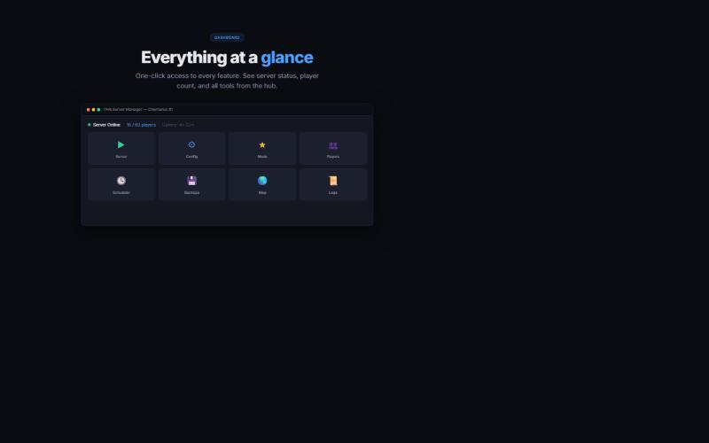
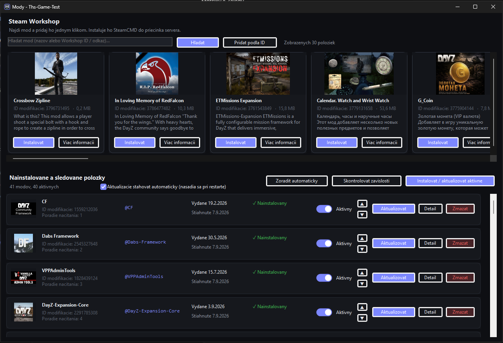
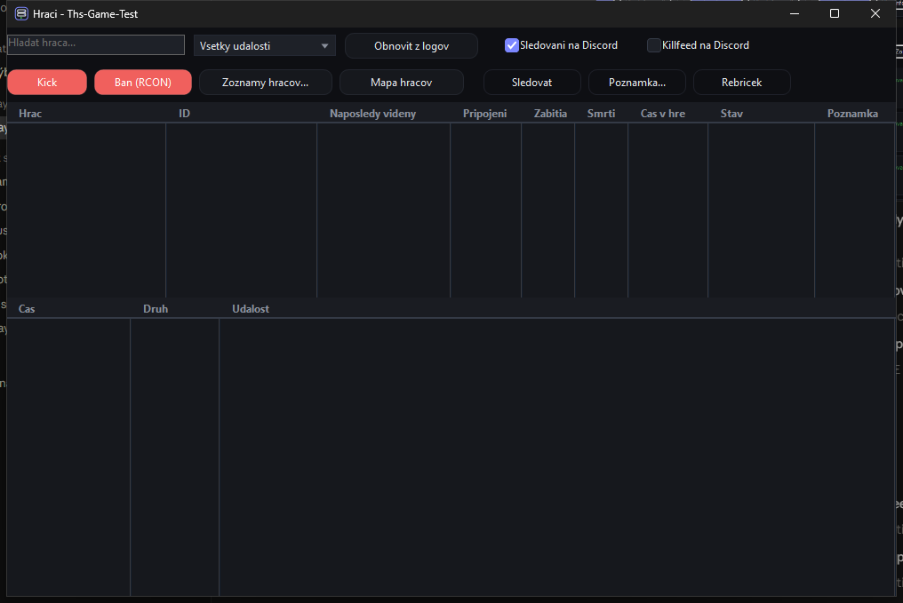
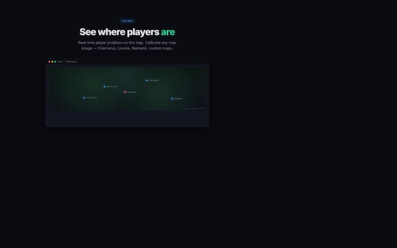
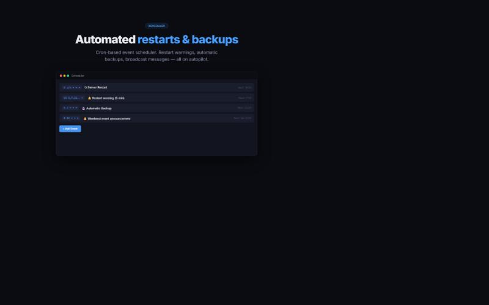
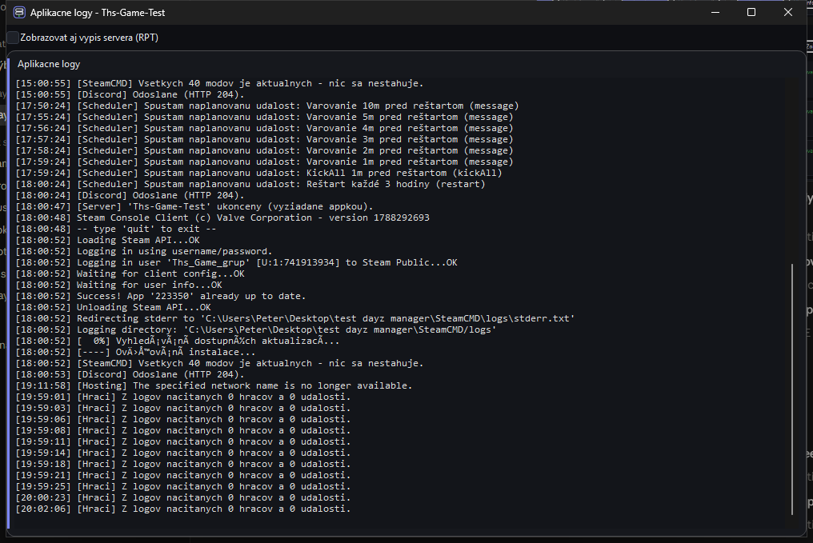
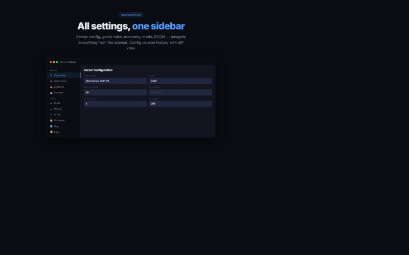

# THS Server Manager

All-in-one tool for managing your DayZ dedicated server on Windows.  
One window: start, monitor, update, and configure — no command line needed.

## Features

**Server Control**
- One-click start / stop / restart
- Automatic crash recovery (restarts the server when it crashes)
- SteamCMD integration — update server and mods before launch
- Process monitoring with uptime tracking

**Mod Management**
- Search Steam Workshop directly from the app
- Install mods with one click — images, descriptions, version info
- Per-mod update button — update only what changed
- Download mods while players are online, deploy on next restart
- Automatic load order and dependency detection

**Player Management**
- Live player list with Steam IDs
- Kill / death / K/D statistics and leaderboard
- Watchlist — get Discord alerts when specific players join
- Player notes for your admin team
- RCON kick, ban, broadcast messages

**Live Map**
- Real-time player positions on the map
- Works with any map — Chernarus, Livonia, Namalsk, custom maps
- Two-point calibration for non-square map images

**Scheduler**
- Cron-based event system
- Automatic restarts with countdown warnings
- Scheduled backups, broadcast messages, kick-all
- Visual next-run preview

**Configuration**
- Sidebar navigation for all server settings
- serverDZ.cfg editor with all fields
- Game rules on one click — PvP/PvE, stamina, base protection
- Economy editor (types.xml)
- Config version history with diff view — see what changed and when

**Backups**
- Automatic and manual backups
- Configurable backup count and auto-cleanup
- One-click restore from any backup point

**Log Viewer**
- Live log tailing with color coding
- Filter by type (errors, warnings, player events)
- Automatic English translation of DayZ log lines
- Crash detection and highlighting

**Other**
- Dark theme UI
- Multi-language (Slovak + English)
- Auto-updates — the manager updates itself
- RCON console with command history
- Reachability monitoring
- Diagnostics export for support

## Download

Go to [**Releases**](../../releases) and download the latest `THS-Server-Manager-Setup-x.x.x.exe`.

> **Windows SmartScreen** may show "Unknown publisher" — click **More info → Run anyway**.  
> This happens because the app is not code-signed (yet). The installer and all updates are verified via SHA-256 checksums.

## Requirements

- Windows 10 or later (64-bit)
- .NET 10 Desktop Runtime (bundled in the installer)
- SteamCMD (the manager downloads it automatically on first run)
- A DayZ dedicated server folder on the same machine

## Getting Started

1. Download and run the installer
2. Register (free — one-time, takes 10 seconds)
3. Click **Add Server** and point it to your DayZ server folder
4. Click **Start** — the manager handles SteamCMD updates, mod deployment, and launch

## Free vs Pro

| Feature | Free | Pro |
|---|:---:|:---:|
| Server start / stop / monitor | ✓ | ✓ |
| Auto-restart on crash | ✓ | ✓ |
| SteamCMD updates | ✓ | ✓ |
| RCON console | ✓ | ✓ |
| Player list & stats | ✓ | ✓ |
| Log viewer | ✓ | ✓ |
| Config editor (serverDZ.cfg) | ✓ | ✓ |
| Backups (manual) | ✓ | ✓ |
| Live map | ✓ | ✓ |
| Auto-updates | ✓ | ✓ |
| Workshop mod search & install | | ✓ |
| Per-mod update control | | ✓ |
| Automated scheduler | | ✓ |
| Player watchlist + Discord alerts | | ✓ |
| Config version history | | ✓ |
| Game rules editor | | ✓ |
| Economy editor | | ✓ |
| Priority support | | ✓ |

## Community

- **Discord:** [Join here](https://discord.gg/BCUwKFq3v5) — support, feature requests, announcements
- **Issues:** Use the [Issues](https://github.com/Hajo02/ths-server-manager/issues) tab for bug reports and feature suggestions

## Screenshots

Click to expand

### Dashboard

### Mod Management

### Player List

### Live Map

### Scheduler

### Log Viewer

### Config Editor

## License

THS Server Manager is proprietary software. Free tier is available at no cost for personal use.  
See the [license agreement](LICENSE.md) for details.

---

*Built for server admins who want to spend time running their community, not fighting their tools.*
